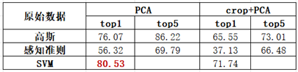
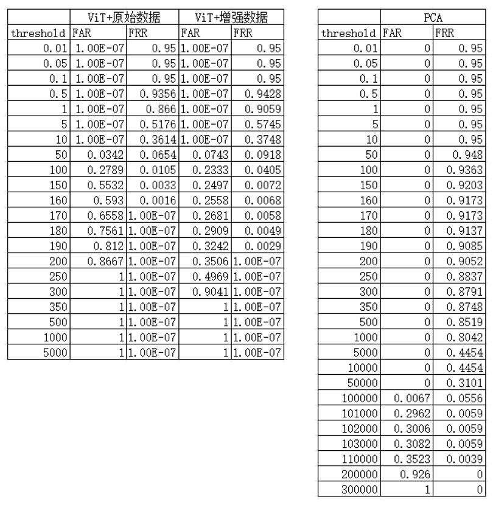
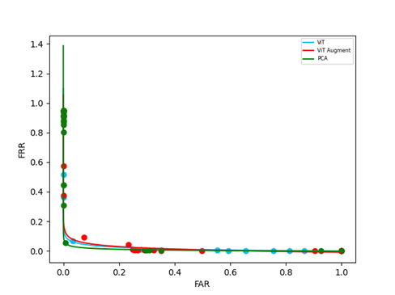

### 文件结构说明：

```
├─code
│  └─...
└─data
    ├─faces94
    ├─faces95
    ├─faces96
    └─grimace
└─cropped_data
    ├─faces94
    ├─faces95
    ├─faces96
    └─grimace
```

通过运行prepare.py，可以自动生成cropped_data文件夹

代码仓库放在[gdfwj/PatternRecognition2023Fall (github.com)](https://github.com/gdfwj/PatternRecognition2023Fall)

### 背景

#### 人脸识别和注册

##### 任务描述

识别：根据已经学习到的人脸对未见人脸图片进行分类

注册：给定某个新类别的一个人脸，模型需要能够正确分类以后见到的此类别人脸

验证：在识别的基础上同时能够判定某些人脸不属于任何一种已知类别

##### 方法

###### 传统方法

特点：基于规则的特征提取，可以用数学模型进行解释

常见的特征提取方法：主成分分析PCA、Haar特征、线性判别分析LDA等。

经典模型：高斯模型、感知机模型、支持向量机等

###### 深度学习方法

特点：基于学习的特征提取

经典模型：CNN、VGGFace、ResNet、Transformer等

##### 注册的特点

用于训练的样本不会很多，往往只会提供一两张

在验证过程中，除了要求正确分类以外，还需要具备识别未注册人脸的能力

#### 人脸验证

### 使用到的技术原理及方法流程


#### 技术及其原理——数据增强、预处理与特征提取

##### 数据增强

###### 目的

对每一个训练集的图片生成其水平翻转图片和添加随机噪声的图片，防止模型因为训练集太小而过拟合

###### 实现

位于dataset.py

```python
class AugmentedDataset(Dataset): 
    def __init__(self, folders=['faces94', 'faces95', 'faces96', 'grimace'], transform=None, one=False, el=False,
                 haar=False, crop=False):
        self.origin_dataset = FaceDataset(folders, transform, one, el, haar, crop)

    def __len__(self):  # 大小变为原数据集的3倍
        return len(self.origin_dataset) * 3

    def __getitem__(self, idx):  # 读取到的图片是原数据集中x/3位置的图片，根据余数决定预处理
        image, target = self.origin_dataset[idx // 3]
        if idx % 3 == 1:
            image = transforms.RandomHorizontalFlip(1)(image)
        if idx % 3 == 2:
            image = image + torch.randn(*image.shape)  # 每次读取添加不同的随机数，保证多样性
        return image, target
```

##### 人脸剪裁（预处理）

###### 目的

剪裁人脸，删去多余背景信息对特征提取的干扰

###### 实现

位于prepare.py，调用MTCNN库预训练模型，调用dataset.get_path()遍历数据集中图像并自动生成剪裁后图像

##### haar特征提取

###### 原理

计算相邻块的像素灰度数值之差形成特征

尝试在3通道彩色图使用

###### 实现

通过调用haar_pytorch([haar-pytorch · PyPI](https://pypi.org/project/haar-pytorch/))库实现，集成在数据集dataset.py中

```python
    def __getitem__(self, idx):
        image, target = self.data[idx], self.class_to_idx[self.target[idx]]
        image = Image.open(image).convert('RGB')
        if self.transform is not None:
            image = self.transform(image)
        if self.haar:
            image = HaarForward()(image.unsqueeze(0)).squeeze(0)  # 生成haar特征
        return image, target
```

##### 主成分分析（PCA）

###### 目的

提取人脸中最主要的特征，防止次要特征干扰，且对高维度的图片数据进行降维减低，计算复杂度

###### 实现

通过调用sklearn库实现，聚合在SVM类中，位于model.py

```python
class SVM:
    def __init__(self, num_classes, h=128, w=128):
    def rgb2gray(self, rgb):  # 将rgb转换为灰度图
    def train(self, X_train, y_train, n_components=150, PCA_=True, onlyPCA=False):
    	# PCA_决定在SVM之前是否使用PCA，onlyPCA决定是否需要训练SVM(在注册验证时仅需学习表示，不需要训练SVM)
    def predict(self, X_test):  # 输出预测类别
    def represent(self, X_test):  # 输出PCA表示，在注册验证使用
```

#### 技术及其原理——分类和表示

##### 高斯分布假设模型

###### 原理

假设每个类别的数据都遵从等方差的高斯分布，即类别$i$的分布为$N(\mu_i,\sigma)$

估计每个类别的均值$\mu_i=\frac{1}{m}\sum_{i=0}^n(x_j)I(y_j==i)$，其中$m$为该类别样本数，即估计均值为所有训练数据的均值

对于输入$x$，计算$x$​与所有类别估计均值的距离，输出距离最近的作为预测

###### 实现

位于model.py

```python
class GaussianDistribution:
	def __init__(self, num_classes): # 初始化存储样本类别数
    def train(self, x, y):  # 输入训练数据，完成训练
    def predict(self, x):  # 输入测试用的x数据，输出预测的y
    def predict_top5(self, x):  # 输入测试用的x数据，输出预测的前五个y
```

##### 感知准则模型

###### 原理

为每个类别设置一个判别函数(或者说分界面)，值大于0则认为这一类为真

每次优化遍历训练数据，对TN/FP的判别函数进行正向/反向调整

预测选取判别函数得分最高的一类为预测类别

###### 实现

位于model.py

```python
class Perception:
	def __init__(self, num_classes): # 初始化存储样本类别数
    def train(self, x, y):  # 输入训练数据，完成训练
    def predict(self, x):  # 输入测试用的x数据，输出预测的y
    def predict_top5(self, x):  # 输入测试用的x数据，输出预测的前五个y
```

##### 支持向量机(SVM)

###### 原理

优化每个类别距离类别分界线的距离

其余与感知准则模型相同

实现：位于model.py，调用sklearn.svm.SVC，类代码详见PCA部分

##### 卷积神经网络(CNN)

###### 原理

通过一系列卷积层、池化层获取图像特征表示

在特征表示后通过一系列全连接层完成分类任务

###### 实现

位于model.py

```python
class CNN(nn.Module):
    def __init__(self, num_classes, in_channels=3, image_size=128):  # 初始化类别数、输入通道数、图片大小，定义层
    def forward(self, x):
    def represent(self, x):  # 输出x通过features层后的结果，即x的特征表示
```

##### Vision Transformer

###### 原理

将图片分割成不同的patches作为Transformer输入

###### 实现

位于moremodel.py

```python
def __init__(self,
                 patches=(8, 8),  # Patch size
                 d_model=128,  # position embedding大小
                 d_ff=128,  # FeedForward 隐藏层维度
                 num_heads=4,  # Multi-Head Attention头数
                 num_layers=3,  # Transformer层数
                 dropout=.1,  # Dropout
                 image_size=(1, 128, 128),  # 图像 channels, height, width
                 num_classes=1,  # 预测类别数
                 ):
def forward(self, x):
def represent(self, x):  # 输出最后一个mlp之前的值，即x的表示
```

#### 方法流程——分类


##### 总览

读取数据集->数据预处理->(特征提取)->训练分类器

##### 实现

###### 高斯模型、感知准则模型与SVM

位于train.py

```python
if __name__ == '__main__':
    torch.manual_seed(2023)  # 设置随机种子用于复现
    transforms = transforms.Compose([
        transforms.Resize((128, 128)),
        transforms.ToTensor(),
        transforms.Normalize([0.2893, 0.3374, 0.4141], [0.0378, 0.0455, 0.0619])
    ]
    )  # 定义数据集预处理方法
    for haar in [True, False]:  # 是否使用haar特征
        for crop in [True, False]:  # 是否使用裁剪数据集
            train_dataset, val_dataset = get_one_dataset(transform=transforms, haar=haar, crop=crop)  # 获取数据集
            train_loader = DataLoader(train_dataset, batch_size=len(train_dataset))  # 一个batch即整个数据集
            val_loader = DataLoader(val_dataset, batch_size=len(val_dataset))
            # if haar:
            #     model = Perception(392, 12*64*64, 1e-5)
            # else:
            #     model = Perception(392, 3*128*128, 1e-5)
            # model = GaussianDistribution(394)
            model = SVM(394)  # 根据使用模型不同来解除注释
            for x, y in train_loader:
                # ...训练
                model.train(x, y, PCA_=False)
            for x, y in val_loader:
                # ...测试
```

###### CNN与Transformer

位于pytorch_models_train.py

```python
# ...数据集和模型定义同上
			model.to(device)  # 加载到gpu
            model.apply(init_normal)  # 初始化
        	lr = 1e-4
            optimizer = torch.optim.Adam(model.parameters(), lr=lr)  # 使用Adam优化器
            epoch = 500
            loss_function = nn.CrossEntropyLoss()
            best_acc = 0.0
            for i in range(epoch):
                loss_ = 0.0
                # ... 训练和验证
                if loss_ < 1e-7:  # 当loss过小提前终止
                    break
```

#### 方法流程——注册和验证


##### 总览

确定数据集->选择表示用模型->使用部分数据注册->逐步使用剩余数据注册并验证

##### 具体实现

###### 辅助类RegisterHelper

位于register.py

```python
class RegisterHelper:
    def __init__(self, model, class_dict_path="class_to_idx.json"):  # 存储表示模型和已有的类别名到id的映射
    def register_pre_train(self, x, y, latent_dim=128):  # 传入预训练数据，每个类别选择一个数据作为该类别的代表
    def register(self, x, y):  # 注册，为y类分配一个id并存储id到y的映射，同时将x的表示作为id的代表
    def registered_predict(self, x, threshold):  # 验证，如果数据集中最近的数据与x表示距离小于threshold，则输出该类别名称，否则输出-1表示拒绝
```

### 数据集和实验设置

#### 数据集

##### 介绍

名称：**Face Recognition Data, University of Essex, UK**

总共包含394个人的人脸信息，每个有20张人脸图片

包含4个子类 ( faces94 , faces95 , faces96 , grimace )

##### 特点

所有图片的人脸已经对齐位于图像正中，同一个人的人脸图片差别并不显著

不同子类中人脸的背景颜色不一样

##### 特殊处理

不同子类中存在人名相同的样本（处理：加载时自动对其进行重命名）(dataset.py)

```python
                    for cls in os.listdir(root_):
                        dup = False  
                        if cls not in self.class_to_idx.keys():
                            self.class_to_idx[cls] = idx
                        else:
                            dup = True  # 出现重复
                            self.class_to_idx[cls+"1"] = idx  # 映射建立时添加1
                        idx += 1
                        class_root = os.path.join(root_, cls)
                        flag = True
                        for pic in os.listdir(class_root):
                            if flag and el:
                                flag = False
                                continue
                            self.data.append(os.path.join(class_root, pic))
                            if dup:
                                self.target.append(cls+"1")
                            else:
                                self.target.append(cls)
                            if one:
                                break
```

存在一个空的样本类别（处理：仍然保留类别），即不做特殊处理（根据上述代码依然会建立类别码及映射，但不会存在数据）

#### 实验设置

##### 人脸识别

###### 数据集划分：所有类别的人脸各随机选择一张作为训练集、剩余为验证集

###### 数据预处理

是否使用**人脸剪裁**

缩放到128*128、归一化

数据增强：在加载数据集时，增加对原图像的**水平翻转**和**加入随机噪声**后的图片

特征提取：主成分分析(PCA)、Haar特征提取

###### 识别模型

高斯分布模型

感知准则模型：lr=1e-5

支持向量机(SVM)：kernel=’rbf’，class_weight='balanced'

卷积神经网络(CNN)：batch_size=64, epochs=500, lr=1e-4

Swin Transformer：patches=(8, 8), Token Dim=128, Feed Forward Dim=128, num_heads=4, num_layers=3, dropout=.1, image_size=(1, 128, 128)，具体含义见**技术原理**部分

##### 人脸注册与验证

###### 数据集划分：使用faces94, faces95, faces96模拟已注册人脸数据集，grimace作为待注册数据集

###### 实验流程

1、遍历grimace数据集，统计验证结果

2、从待注册数据集中选择一个未注册的类别进行注册

3、返回第1步，直到所有类别均已注册，计算最终结果

```python
    with torch.no_grad():
        for threshold in thresholds:
            train_dataset = get_all(name=['faces94', 'faces95', 'faces96'], transform=transform, haar=False)  # 获取前三类数据集
            train_loader = DataLoader(train_dataset, len(train_dataset))
            model = ...  # 特征提取模型，并加载
            from register import RegisterHelper
            register = RegisterHelper(model)
            for x, y in train_loader:
                x = x.to(device)
                y = y.to(device)
                register.register_pre_train(x, y)  # 预训练
            test_set = get_all(name=['grimace'], transform=transform, haar=False)  # 获取测试用数据集
            register_dict = {}  # 存储还未注册的类别及其中一个图像
            FAR = 0
            FRR = 0
            count = 0
            TP = 0
            FN = 0
            for x, y in test_set:
                if y not in register_dict.keys():  # 建立
                    register_dict[y] = x
            for now_register in list(register_dict.keys()):  # 遍历grimace中的所有类
                for x, y in test_set:  # 遍历全部grimace数据
                    x = x.to(device)
                    pred = register.registered_predict(x, threshold)  # 计算所属类别
                    if y in register_dict.keys():  # y未注册
                        if pred != -1:  # FAR
                            FAR += 1
                        else:
                            FN += 1
                    else:  # y已注册
                        if pred == -1:
                            FRR += 1
                        elif pred == y:
                            TP += 1
                        count += 1
                register.register(register_dict[now_register].to(device), now_register)  # 注册当前类
                register_dict.pop(now_register)  # 移出未注册字典
            print(TP, FAR, FRR, FN, count)
            print(f"threshold: {threshold}, FAR:{FAR / (FAR + FN)}, FRR:{FRR / count}")
```


###### 数据预处理：与使用的特征提取模型保持一致

###### 特征提取模型：选择在分类任务中表现最好的模型&预处理作为图像到特征空间的映射

PCA+SVM：保留PCA部分

CNN/Swin Transformer：选取倒数第二层作为特征表示(represent方法)

### 实验结果与分析

#### 人脸识别




##### 实验结果

在使用原始数据情况下，高斯分布模型在不提取特征和剪裁时效果最好，但是在数据增强后效果急剧下降

感知准则模型、CNN和Transformer都在数据增强后的效果得到了很大的提升

在使用裁剪或者haar特征提取后，几乎所有模型的表现都变差

在对剪裁后的图像haar特征提取后，一些模型的表现变好

使用PCA后，感知准则模型表现得到很大的提升，且SVM取得了很好的结果

##### 分析

原始数据的分布简单且集中

高斯分布的鲁棒性、泛化性差（在数据增强后效果急剧下降）

通过数据增强，避免了原始数据下数据量过小导致过拟合训练数据

图像裁剪会出现图片大小不一、裁剪失败的结果，导致模型表现变差

haar特征对旋转、人脸比例敏感，且不适用于彩色图片

PCA能较为成功地提取图像中人脸的特征

#### 人脸注册与验证





在数据增强前后，ViT模型的注册验证效果没有较大差异

PCA在注册验证中的表现最好

通过FAR数值，我们发现不同类别的图片使用PCA生成的特征表示，在特征空间中的距离更大

### 总结

##### 我们尝试在每个类别仅有一个数据进行训练的情况下，对传统模型和深度学习模型在不同的数据预处理、数据增强、特征提取的基础上的分类效果进行了实验评估

（1）水平翻转和添加随机噪声进行的数据增强，能够缓解学习方法在小训练集下的过拟合问题，提高模型在人脸识别任务中的表现

（2）高斯分布的鲁棒性、泛化性差，数据较小的改变会对识别效果产生很大的影响。

（3）PCA能较为成功地提取图像中人脸的特征，人脸图像通过PCA特征提取后在特征空间中的分布稀疏。

（4）haar特征适用于人脸在图片中占比比较固定的数据集，例如剪裁后的

（5）由于训练集过小，剪裁质量的会极大的影响效果（剪裁差的图像如果被选为训练数据则会使这一类完全失效）

（6）可能由于数据的相似性强，容易过拟合的深度模型依然有效，并且深度学习方法对于数据扰动的鲁棒性强
